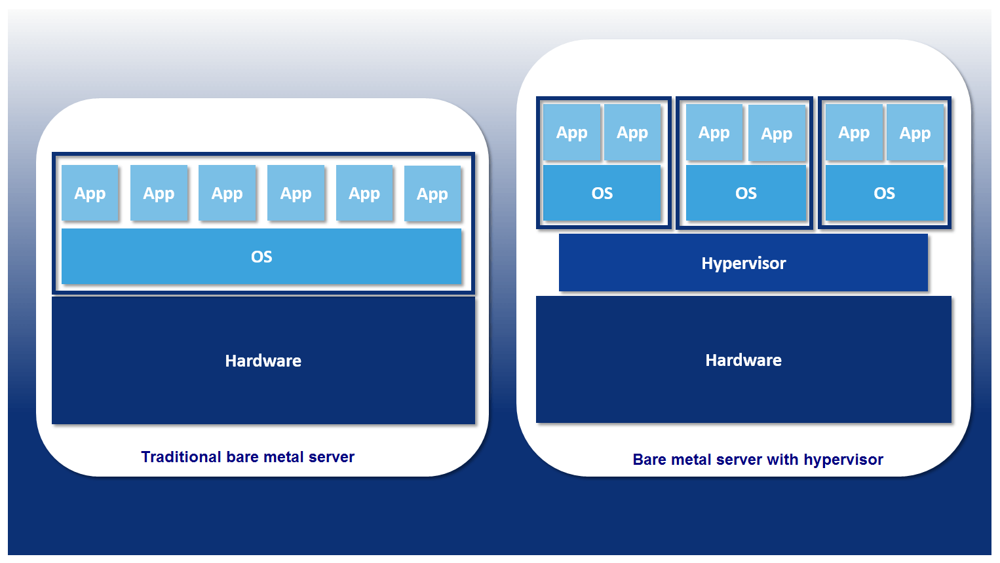
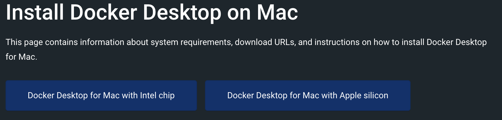
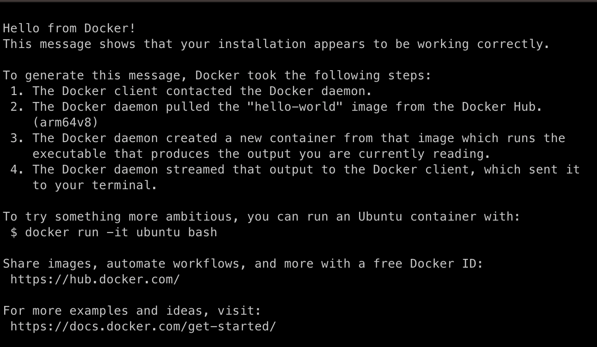
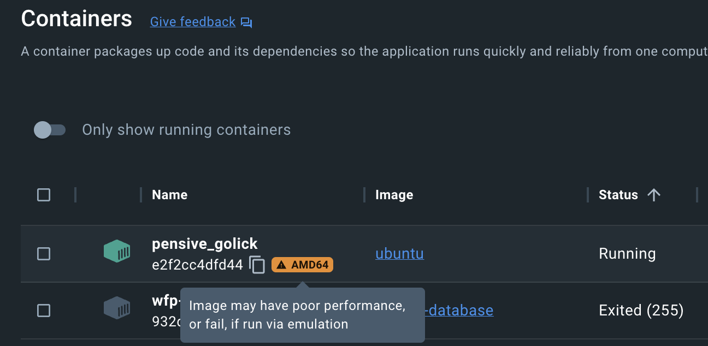

 # Docker dla QA


---

# Architektury przed Dockerem

- bare metal
- wirtualne maszyny
---



---

# Bare metal
## Zalety

- Wysoka wydajność
- W pełni wyizolowane środowisko
## Wady
- Słaba skalowalność
- Niewykorzystane zasoby się marnują

---

# Wirtualne maszyny
## Zalety
- Łatwiejsza skalowalność
## Wady
- Potrzeba hypervisora
- Brak wspólnych warstw między VM


---

# Kontenery


---

## Zalety
- Bardzo skalowalne
- Każdy kontener na bazie tego samego obrazu jest identyczny
- Współdzielenie warstw

## Wady
:sweat_smile:

---

# Czym jest?

  _Standaryzowaną platformą do tworzenia i zarządzania kontenerami_


---

# Instalacja

[Docker Desktop](https://docs.docker.com/desktop/install/mac-install/)



albo

```
brew install --cask docker
```
---

## Hello World

```
docker run hello-world
```


---
# Podstawowe komendy
- docker run - utwórz i uruchom kontener
- docker start - uruchom zatrzymany kontener
- docker stop - zatrzymaj uruchomiony kontener
- docker ps - wyświetl uruchomione kontenery
- docker exec - wykonaj polecenie w ***uruchomionym !*** kontenerze
- docker build - utwórz obraz na podstawie pliku Dockerfile
---

# Tworzenie kontenera
```
docker run [flagi] nazwa_obrazu[:tag]
```

---

# Używane flagi
  [Pełna dokumentacja](https://docs.docker.com/engine/reference/run/)


  - `-p <port_hosta>:<port_kontenera>`
    - mapowanie portów np. 5432:5432
  - `-v <ścieżka_folderu_hosta>:<cel_montowania>`
    - montowanie volumów np. /config:/config
  - `-d` 
    - uruchomienie kontenera w trybie *detach*, bez tej flagi wchodzimy do kontenera i widzimy output
  
  ---
# Używane flagi cd

  - `-e`NAZWA_ZMIENNEJ_ŚRODOWISKOWEJ=<wartośc_zmiennej>
  - `--name` *nasza_nazwa*
    - można nazwać kontener w celu łatwiejszej identyfikacji
    - domyślnie Docker sam nada mu nazwę
    - **nazwa musi byc unikalna**
  - `--rm`
    - po zakończeniu polecenia lub po zatrzymaniu kontenera kontener zostanie usunięty
  
  ---
  # Przykładowe utworzenie bazy danych Postgres

  ```
    docker run --name baza-testowa -d -p 5432:5432 -e POSTGRES_PASSWORD=silnehaslo postgres
  ``` 

---

# :hook: dla miłośników jabłek i malinek

Obraz jest budowany dla danej architektury CPU, standardem jest obecnie *amd64*, jednak rośnie popularność komputerów Apple i Raspberry Pi, które posiadają architekturę *arm*.

---

# Emulacja innej platformy

### Można przy użyciu flagi `--platform` zasymilować inną niekompatybilną architekturę


---

# Uruchomienie kontenera z inną architekturą
```
docker run --platform linux/amd64 -it ubuntu bash
```


---

# Skąd brać obrazy kontenera?

## [Docker Hub](https://hub.docker.com/)
  
---

# Inne przydatne linki

- [Play with Docker Online](https://www.docker.com/play-with-docker/)
- [Docker VS Code Extension](https://marketplace.visualstudio.com/items?itemName=ms-azuretools.vscode-docker)
- [Dokumentacja](https://docs.docker.com/)

---

# Fin

